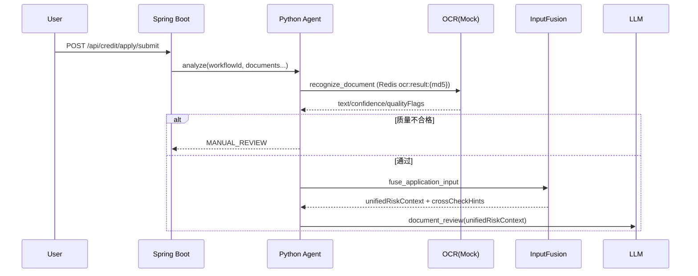
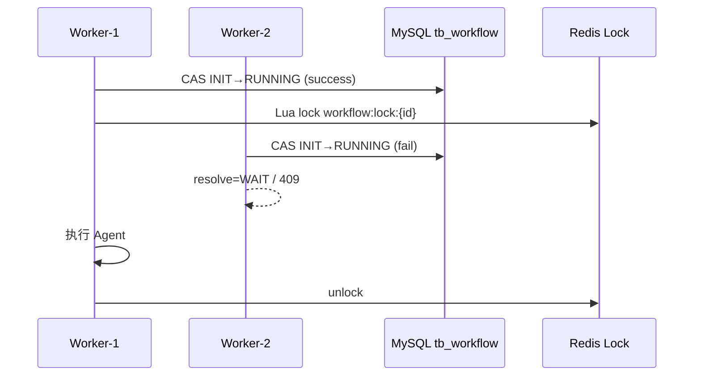
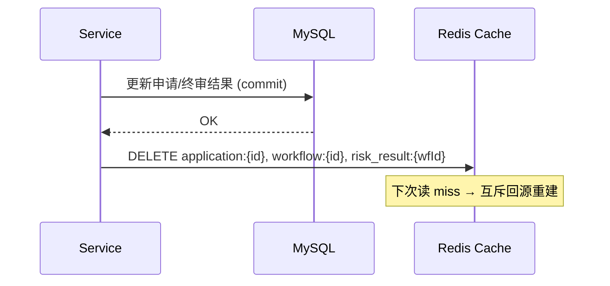

# 智能信贷风控平台

消费信贷风控演示系统：Java 平台负责业务与终审，Python Agent 负责 LangGraph 多节点分析，React 前端提供申请与复核界面。

## 架构

```
credit-risk-web (React, :5173 / Docker :80)
        │  /api
        ▼
credit-risk-platform (Spring Boot, :8082)
        │  HTTP analyze
        ▼
credit-agent (FastAPI + LangGraph, :8090)
        │  Tool 回调 / MCP 外部风控
        └──────────────────────────► Java 内部 Tool 网关
```

| 模块 | 技术 | 职责 |
|------|------|------|
| `credit-risk-platform` | Spring Boot 2.3, MyBatis-Plus, MySQL, Redis | 登录、申请、异步任务、规则引擎终审、人工复核 |
| `credit-agent` | FastAPI, LangGraph, DeepSeek | 文档审核、征信评估、反欺诈、共识仲裁（仅风险建议） |
| `credit-risk-web` | React 18, TypeScript, Vite, Ant Design | 申请提交、任务轮询、管理端复核 |

**原则**：Agent 只输出 `SUGGEST_*` 建议；最终 `APPROVED` / `REJECTED` / `MANUAL_REVIEW` 由 Java `CreditApprovalEngine` 规则引擎决定。

## 前置依赖

- JDK 8+
- Maven 3.6+
- Python 3.10+
- Node.js 18+
- MySQL 5.7+（本地示例端口 `3307`）
- Redis 7+
- DeepSeek API Key（或兼容 OpenAI 协议的模型服务）

## 快速启动（本地）

### 1. 数据库

```bash
mysql -u root -p < credit-risk-platform/src/main/resources/db/credit_schema.sql
mysql -u root -p credit < credit-risk-platform/src/main/resources/db/credit_seed.sql
mysql -u root -p credit < credit-risk-platform/src/main/resources/db/migration/V001_workflow_persistence.sql
mysql -u root -p credit < credit-risk-platform/src/main/resources/db/migration/V002_prompt_rule_config.sql
mysql -u root -p credit < credit-risk-platform/src/main/resources/db/migration/V003_audit_log.sql
mysql -u root -p credit < credit-risk-platform/src/main/resources/db/migration/V004_cache_hit.sql
mysql -u root -p credit < credit-risk-platform/src/main/resources/db/migration/V005_input_fusion_workflow_init.sql
mysql -u root -p credit < credit-risk-platform/src/main/resources/db/migration/V006_product_dynamic_config.sql
```

默认连接见 `credit-risk-platform/src/main/resources/application.yml`（`127.0.0.1:3307`，库名 `credit`）。

### 2. Redis

确保 `127.0.0.1:6379` 可访问。

### 3. Java 后端

```bash
cd credit-risk-platform
mvn spring-boot:run
```

服务地址：`http://127.0.0.1:8082`

### 4. Python Agent

```bash
cd credit-agent
python -m venv .venv
# Windows: .venv\Scripts\activate
# macOS/Linux: source .venv/bin/activate
pip install -r requirements.txt
cp .env.example .env
# 编辑 .env，填入 OPENAI_API_KEY
uvicorn app.main:app --host 0.0.0.0 --port 8090
```

### 5. 前端

```bash
cd credit-risk-web
npm install
npm run dev
```

浏览器访问 `http://localhost:5173`。开发模式下 `/api` 代理到 `8082`。

## Docker Compose

在项目根目录：

```bash
# 需先设置 DeepSeek Key
set OPENAI_API_KEY=your-key   # Windows
# export OPENAI_API_KEY=your-key   # macOS/Linux

docker compose up --build
```

| 服务 | 端口 |
|------|------|
| Web (Nginx) | 80 |
| Java 后端 | 8082 |
| Python Agent | 8090 |
| MySQL | 3307 |
| Redis | 6379 |

首次启动后需手动导入 `credit_schema.sql` 与 `credit_seed.sql` 到 MySQL 容器（或挂载初始化脚本）。

## 演示流程

1. 前端 `/login`：使用种子数据手机号登录（如 `13800000001`），验证码在开发模式下由接口返回。
2. `/apply`：提交信贷申请，获得 `taskId`。
3. `/tasks/:taskId`：轮询异步任务直至 `SUCCESS`。
4. `/applications`：查看平台终审结果与风险分。
5. `/admin/reviews`：管理员对 `MANUAL_REVIEW` 申请人工通过/拒绝。

## Agent 工作流

```
load_memory → ocr_preprocess → input_fusion → document_review → document_verify
→ credit_assessment → anti_fraud → consensus → suggestion_routing → final
→ Java CreditApprovalEngine（动态产品规则 + 终审额度/期限/利率）
```

- **OCR**：上传材料先 OCR 成文本（`MockOcrService`），LLM 不直接读图片
- **Input Fusion**：结构化字段 + 用户自然语言 + OCR 文本 → `unifiedRiskContext`
- **Spring Tool**：用户记忆、产品信息、文档校验、反欺诈规则、轨迹落库（`POST /internal/tools/invoke`）
- **MCP Tool**：征信、法院执行、收入稳定性（stdio 子进程或 inprocess 模式）

## 配置说明

| 配置 | 位置 | 说明 |
|------|------|------|
| `OPENAI_API_KEY` | `credit-agent/.env` | DeepSeek API Key，**勿提交到 Git** |
| `credit.agent.base-url` | `application.yml` | Java 调用 Agent 的地址 |
| `credit.agent.internal-api-key` | `application.yml` / Agent `.env` | 双向内部接口密钥，默认 `credit-agent-secret` |
| `spring.datasource.*` | `application.yml` | MySQL 连接 |

## 目录结构

```
.
├── docker-compose.yml
├── credit-risk-platform/    # Spring Boot 业务平台
├── credit-agent/            # LangGraph Agent
├── credit-risk-web/         # React 前端
└── README.md
```

## 安全提示

- 不要将 `.env` 或真实 API Key 提交到仓库。
- `application.yml` 中的数据库密码与内部密钥仅用于本地演示，生产环境请使用环境变量或密钥管理服务。

---

## Phase 1：Workflow 工程化能力

### 数据库迁移

首次升级请执行：

```bash
mysql -u root -p credit < credit-risk-platform/src/main/resources/db/migration/V001_workflow_persistence.sql
```

### 新增表

| 表名 | 用途 |
|------|------|
| `tb_workflow` | Workflow 主状态（status、current_node、retry_count、result_json） |
| `tb_workflow_node` | 每个节点执行前后记录（input/output、error、retry、耗时） |
| `tb_workflow_checkpoint` | LangGraph State 快照（state_json、history、断点续跑） |

### 核心能力

- **节点状态持久化**：Agent 每个节点执行前后写入 `tb_workflow_node`
- **Checkpoint**：每个节点成功后保存 State 到 `tb_workflow_checkpoint`
- **断点续跑**：服务重启后从最后成功节点继续（`graph_runner` 顺序执行器）
- **Retry**：单节点最多 3 次，退避 2s / 4s / 8s，超限进入 `MANUAL_REVIEW`
- **幂等**：`workflow_id` 重复请求不重复跑 Agent；SUCCESS 直接返回缓存结果；RUNNING 返回 409
- **Trace 日志**：`trace_id、workflow_id、node_name、agent_name、retry_count、cost_time、error_code`

### 查询执行链路

```http
GET /api/admin/credit/workflow/{workflowId}
```

任务轮询接口也会附带 `workflowExecution` 字段：

```http
GET /api/credit/apply/task/{taskId}
```

### 如何测试

**1. 幂等**

对同一 `workflowId` 连续调用 Agent analyze，第二次应直接返回缓存（不再调用 LLM）：

```bash
curl -X POST http://127.0.0.1:8090/v1/agents/credit/analyze \
  -H "Content-Type: application/json" \
  -H "X-Internal-Api-Key: credit-agent-secret" \
  -d '{"userId":1,"productId":1,"applyAmount":50000,"content":"...","workflowId":"wf-idem-demo"}'
```

**2. Retry / 人工审核**

在节点函数中临时 `raise RuntimeError` 可触发 3 次重试；仍失败则 `tb_workflow.status=MANUAL_REVIEW`。

**3. 断点续跑**

1. 执行到中间节点后强制停止 Agent 进程  
2. 查 `tb_workflow_checkpoint` 确认 `current_node`  
3. 用相同 `workflowId` 再次调用 analyze，应从下一节点继续

**4. 单元测试**

```bash
cd credit-risk-platform && mvn test -Dtest=WorkflowIdempotencyServiceTest
cd credit-agent && pytest tests/test_workflow_retry.py tests/test_workflow_graph_runner.py -q
```

---

## Phase 2：Prompt / Rule 配置化与输出校验

### 数据库迁移

```bash
mysql -u root -p credit < credit-risk-platform/src/main/resources/db/migration/V002_prompt_rule_config.sql
```

### 新增表

| 表名 | 用途 |
|------|------|
| `tb_prompt_config` | Agent System Prompt 多版本配置 |
| `tb_rule_config` | 欺诈权重、终审阈值、风险评分权重 |

### 核心能力

- **Prompt 配置化**：Agent 通过 Tool `get_prompt_config` 拉取最新启用版本，失败时回退内置默认 Prompt
- **Rule 配置化**：`FraudRuleEngine`、`CreditApprovalEngine`、`CreditRiskScoreService` 从 `tb_rule_config` 读取规则，无配置时使用代码默认值
- **严格 Schema 校验**：LLM 输出经 `validate_or_repair` 修复仍失败时抛出 `SchemaValidationError`，触发节点 Retry（最多 3 次），超限进入 `MANUAL_REVIEW`
- **管理端回滚**：查看版本列表并回滚到历史版本

### 管理 API

```http
GET  /api/admin/config/prompt/{promptCode}/versions
POST /api/admin/config/prompt/{promptCode}/rollback/{version}

GET  /api/admin/config/rule/{ruleCode}/versions
POST /api/admin/config/rule/{ruleCode}/rollback/{version}
```

### 新增 Tool

| Tool | 说明 |
|------|------|
| `get_prompt_config` | 参数 `promptCode`，返回 `promptContent`、`version` |
| `get_rule_config` | 参数 `ruleCode`，返回 `ruleContent`、`version` |

### 如何测试

```bash
cd credit-risk-platform && mvn test
cd credit-agent && pytest tests/test_prompt_loader_and_strict_validation.py -q
```

---

## Phase 3：Agent 稳定性

### 核心能力

| 能力 | 实现位置 | 说明 |
|------|----------|------|
| Agent 超时 | `app/resilience/timeout.py` + `graph_runner` | 每个 LLM Agent 节点默认 15s，超时触发 Retry |
| 健康检查 | `AgentHealthService` + `/v1/agents/health` | 状态：`UP` / `DOWN` / `DEGRADED` |
| 熔断 | `AgentCircuitBreaker` + `AgentHttpExecutor` | 连续失败 5 次熔断，冷却后半开探测 |
| LLM 限流 | `app/resilience/llm_rate_limiter.py` | 并发 + 每分钟请求数双限，超限排队等待 |

### 配置项

| 配置 | 位置 | 默认 |
|------|------|------|
| `AGENT_NODE_TIMEOUT_SEC` | `credit-agent/.env` | 15 |
| `AGENT_CIRCUIT_FAILURE_THRESHOLD` | Agent `.env` | 5 |
| `LLM_RATE_LIMIT_PER_MINUTE` | Agent `.env` | 60 |
| `credit.agent.health-check-interval-ms` | `application.yml` | 10000 |
| `credit.agent.circuit-half-open-max-probes` | `application.yml` | 1 |

### 健康检查 API

```http
GET /v1/agents/health                              # Python Agent 各子 Agent 状态
GET /api/admin/agent/health                        # Java 管理端聚合视图（需登录）
```

Agent 不可用时，Java 异步任务不会失败，而是生成 `needManualReview=true` 的兜底结果。

### 如何测试

**1. 熔断**

连续让某 Agent 节点失败 5 次（如临时注入异常），再调用应直接转 `MANUAL_REVIEW`（`AGENT_CIRCUIT_OPEN`）。

**2. 超时**

将 `AGENT_NODE_TIMEOUT_SEC=1`，提交复杂申请，观察节点 Retry 日志。

**3. 限流**

将 `LLM_RATE_LIMIT_MAX_CONCURRENT=1` 且 `LLM_RATE_LIMIT_PER_MINUTE=2`，并发提交多笔申请，观察排队与 `LlmRateLimitExceeded` 重试。

**4. 单元测试**

```bash
cd credit-risk-platform && mvn test -Dtest=AgentHealthServiceTest,AgentHttpExecutorTest
cd credit-agent && pytest tests/test_resilience_phase3.py -q
```

---

## Phase 4：审计日志与监控指标

### 数据库迁移

```bash
mysql -u root -p credit < credit-risk-platform/src/main/resources/db/migration/V003_audit_log.sql
```

### 新增表

| 表名 | 用途 |
|------|------|
| `tb_audit_log` | 每次 LLM / Tool 调用的 request、response、token、耗时、prompt 版本 |

### 核心能力

- **审计日志**：Python Agent 通过 Tool `save_audit_log` 写入；含 `workflow_id`、`node_name`、`prompt_version`、`token_count`、`cost_time_ms`
- **Micrometer 指标**（`/actuator/metrics`）：
  - `agent.node.invoke` — 节点成功率 / 失败率
  - `agent.node.retry` — Retry 次数
  - `agent.llm.tokens` — Token 消耗
  - `agent.llm.invoke` — LLM 调用次数
  - `workflow.manual_review` — 人工审核数量
  - `agent.remote.call` — Java 调用 Python Agent 次数

### 管理 API

```http
GET /api/admin/audit/workflow/{workflowId}
GET /api/admin/metrics/summary
```

### 如何测试

```bash
cd credit-risk-platform && mvn test -Dtest=AuditLogServiceTest
cd credit-agent && pytest tests/test_audit_recorder.py -q
```

提交一笔申请后查询：

```http
GET /api/admin/audit/workflow/{workflowId}
GET /actuator/metrics/agent.llm.tokens
```

---

## Phase 5：OCR / LLM 结果缓存

### 数据库迁移

```bash
mysql -u root -p credit < credit-risk-platform/src/main/resources/db/migration/V004_cache_hit.sql
```

（`tb_audit_log` 增加 `cache_hit` 字段，标记是否命中缓存。）

### 缓存 Key（Redis）

| Key 模式 | 用途 | 默认 TTL |
|----------|------|----------|
| `llm:result:{prompt_version}:{input_hash}` | 相同 Prompt 版本 + 相同输入的 LLM 输出 | 24h |
| `ocr:result:{file_md5}` | 相同资料内容的文档审核结果 | 72h |

### 核心能力

- **LLM 缓存**：`invoke_llm()` 调用前先查 Redis，命中则跳过 DeepSeek 调用，`cache_hit=true` 写入审计日志
- **OCR/资料缓存**：`document_review` 节点对 `content` 做 MD5，命中则跳过 LLM
- **Token 优化**：重复申请相同资料 / 相同输入时不再消耗 Token
- **指标**：`agent.llm.cache_hit` 统计缓存命中次数

### 配置

| 配置 | 位置 | 默认 |
|------|------|------|
| `CACHE_ENABLED` | Agent `.env` | true |
| `credit.agent.cache.llm-ttl-hours` | `application.yml` | 24 |
| `credit.agent.cache.ocr-ttl-hours` | `application.yml` | 72 |

### 新增 Tool

| Tool | 说明 |
|------|------|
| `get_llm_cache` / `set_llm_cache` | LLM 结果读写 |
| `get_ocr_cache` / `set_ocr_cache` | 资料解析结果读写 |

### 如何测试

**1. LLM 缓存**

对同一 `workflowId` 重复跑两次相同输入的节点，第二次 `tb_audit_log.cache_hit=1` 且 `token_count=0`。

**2. 资料缓存**

两次提交 `content` 完全相同的申请，第二次 `document_review` 应直接返回缓存。

**3. 单元测试**

```bash
cd credit-risk-platform && mvn test -Dtest=AgentResultCacheServiceTest
cd credit-agent && pytest tests/test_llm_cache.py -q
```

---

## Phase 6：输入融合 + OCR + Workflow 防重 + 缓存增强

### 数据库迁移

```bash
mysql -u root -p credit < credit-risk-platform/src/main/resources/db/migration/V005_input_fusion_workflow_init.sql
```

### 新增能力概览

| 模块 | 说明 |
|------|------|
| `InputFusionService` | 融合 structuredApplication / userNarrative / ocrDocuments → `unifiedRiskContext` |
| `MockOcrService` | OCR 抽象层默认实现，预留 `TencentOcrService` / `AliyunOcrService` |
| `ocr_preprocess` 节点 | 材料 OCR + 质量门禁（低置信度/模糊/复印件/截图/篡改 → `MANUAL_REVIEW`） |
| `input_fusion` 节点 | 调用 Tool `fuse_application_input` 生成融合上下文 |
| Workflow `INIT` + CAS | `INIT → RUNNING` 原子抢占，防重复消费 |
| `WorkflowLockService` | Redis Lua 锁 `workflow:lock:{workflowId}`，TTL 5min |
| Cache Aside 增强 | 空值缓存 2min、TTL ±10% 抖动、热点 Key 互斥回源 |

### 总体架构（Phase 6）

```
React ──► Spring Boot ──► FastAPI/LangGraph
              │                │
              │                ├── OCR Preprocess (Mock)
              │                ├── Input Fusion
              │                └── Multi-Agent
              ├── Java Rule Engine (终审)
              ├── MySQL (Workflow 最终状态)
              └── Redis (锁 / 缓存)
```

### 完整调用链

```
用户提交申请（结构化字段 + 自然语言 + 材料元数据）
  → Java 创建 async task + workflow(INIT)
  → @Async Worker：Redis Lua 锁 + CAS(INIT→RUNNING)
  → Python Agent：ocr_preprocess → input_fusion → Multi-Agent
  → Java CreditApprovalEngine 终审
  → MySQL 提交 + evictApplication/evictWorkflow/evictRiskResult
  → 前端轮询 task 结果
```

### 时序：OCR + Input Fusion



### 时序：Workflow 防重复消费



### 时序：Cache Aside 写后失效



### Redis Key 设计

| Key | 用途 | TTL |
|-----|------|-----|
| `workflow:lock:{workflowId}` | 分布式执行锁 | 5min |
| `application:{id}` | 申请详情 | 10min ±10% |
| `workflow:{id}` | Workflow 查询缓存 | 按需 |
| `risk_result:{workflowId}` | 风控结果缓存 | 按需 |
| `ocr:result:{fileMd5}` | OCR 文本结果 | 72h |
| `llm:result:{promptVersion}:{inputHash}` | LLM 输出 | 24h |

### 向后兼容

- 旧客户端仍只传 `content` 字段即可跑通（无材料时跳过 OCR）
- 新增可选字段：`income`、`occupation`、`documents[]` 等，不改变已有 API 路径

### 新增 Tool

| Tool | 说明 |
|------|------|
| `recognize_document` | OCR 识别 + Redis 缓存 + 审计 |
| `fuse_application_input` | 生成 `unifiedRiskContext` |
| `acquire_workflow_execution` | Lua 锁 + CAS 抢占 |
| `release_workflow_lock` | 释放锁 |

### 单元测试

```bash
cd credit-risk-platform && mvn test
cd credit-agent && pytest tests/test_input_fusion.py tests/test_ocr_preprocess.py -q
```

---

## Phase 7：架构职责收敛 + 产品规则动态化

### 为什么删除 `credit_advisory`

原 `credit_advisory` 与 `consensus` 职责重叠，且容易让 LLM 参与额度、利率、期限决策，不符合真实消费信贷风控的职责边界。用户申请时已选择 `productId`，系统不再做产品推荐。

### 新职责划分

| 层 | 职责 |
|----|------|
| **Agent** | 材料理解、风险识别、风险解释，输出 `SUGGEST_*` |
| **Consensus** | 聚合多 Agent 风险判断，结合 `productContext` 输出风险等级与摘要 |
| **Java Rule Engine** | 读取动态产品规则 + Agent 风险结果，生成最终审批、额度、期限、利率 |

### 产品配置表

| 表 | 用途 |
|----|------|
| `tb_credit_product` | 产品基础信息（额度范围、期限、基础利率） |
| `tb_product_rule_config` | 产品级规则 JSON（风险等级系数、阈值），支持版本与回滚 |
| `tb_product_material_requirement` | 产品材料要求（必传/可选、置信度、月份） |

迁移脚本：

```bash
mysql -u root -p credit < credit-risk-platform/src/main/resources/db/migration/V006_product_dynamic_config.sql
```

### Redis 缓存 Key

- `product:{productId}`
- `product_rule:{productId}:{version}`
- `product_material:{productId}`

产品或规则变更后主动删除缓存。

### Agent 获取产品上下文（Java Tool）

- `get_credit_product(productId)` → `productContext`
- `get_product_rule_config(productId)`
- `get_product_material_requirements(productId)`

Agent 仅用 `productContext` 做风险参考（材料是否齐全、申请金额/期限是否异常），**不**输出额度/利率/期限。

### 管理端产品规则回滚

```http
GET  /api/admin/config/product/{productId}/rules/versions
POST /api/admin/config/product/{productId}/rules/rollback/{version}
```

### 项目亮点（更新）

**动态产品配置 + Agent 风险理解 + Consensus 风险仲裁 + Java Rule Engine 确定性终审**

### 单元测试

```bash
cd credit-risk-platform && mvn test
cd credit-agent && pytest tests/test_architecture_refactor.py tests/test_e2e_stability_integration.py -q
```

### E2E / 灰度 / 稳定性测试（Phase 7+）

| 类型 | Java 测试类 | 覆盖点 |
|------|------------|--------|
| E2E | `CreditApplyPipelineE2ETest` | Mock Agent → Java Rule Engine 终审（低/中/高风险、OCR 低置信度） |
| E2E | `CreditApplyAsyncProcessorE2ETest` | 异步 task 链路、workflowId 幂等 |
| 灰度 | `ProductRuleVersionGrayTest` | 产品规则 V1/V2/回滚、缺失规则安全默认 |
| 灰度 | `RuleConfigSafeDefaultGrayTest` | 高风险不可默认放行 |
| 稳定性 | `WorkflowExecutionStabilityTest` | 幂等、锁过期、CAS 失败 |
| 稳定性 | `CacheClientHotKeyStabilityTest` | 热点 Key 互斥回源 |
| 稳定性 | `AgentHttpCircuitBreakerStabilityTest` / `CreditApplyAsyncDegradationStabilityTest` | 熔断、Agent 不可用降级 |
| Python | `test_e2e_stability_integration.py` | Workflow 幂等、Prompt V2、Retry、Checkpoint 续跑 |

```bash
cd credit-risk-platform && mvn test -Dtest="*E2ETest,*GrayTest,*StabilityTest"
cd credit-agent && pytest tests/test_e2e_stability_integration.py tests/test_workflow_retry.py -q
```

---

## 设计原因与方案取舍

### 1. 为什么 Java 和 Python 分离？

| 对比 | Java | Python + LangGraph |
|------|------|---------------------|
| 优势 | 事务、规则引擎、MySQL/Redis 成熟 | Multi-Agent 编排生态成熟 |
| 劣势 | Agent 编排代码量大 | 企业 CRUD 不如 Java 顺手 |

**结论**：Java 做业务平台与终审，Python 做 Agent 工作流，HTTP + Tool 回调协作。

### 2. 为什么 Java Rule Engine 终审，而不是 LLM 直接审批？

LLM 有随机性与幻觉；审批必须可解释、可审计、可复现。Agent 只输出 `SUGGEST_*`，最终 `APPROVED/REJECTED/MANUAL_REVIEW` 由 `CreditApprovalEngine` 决定。

### 3. 为什么 OCR 后仍处理用户自然语言？

OCR 只能提取材料文字；借款用途、收入说明等自然语言仍含风险信息。融合输入 = 结构化字段 + 用户自然语言 + OCR 文本。

### 4. 为什么 Agent 不直接分析图片？

企业风控更关注结构化文本；OCR 成本更低、置信度可量化、结果可校验；LLM 负责理解 OCR 文本与用户填写之间的矛盾（如申报收入 15000 vs 流水平均 8000）。

### 5. 为什么 Workflow 状态放 MySQL？

Workflow 需持久化、审计、断点续跑；Redis 适合锁与缓存；MySQL 作为最终状态源。

### 6. 为什么 Redis Lua，而不是 synchronized？

`synchronized` 仅单 JVM 有效；多实例部署需 Redis Lua 原子「判断 + 加锁 + 过期」。

### 7. 为什么当前不用 MQ？

当前异步量小；MySQL 任务表 + Workflow 状态机已满足幂等、审计、失败恢复。后续量大可引入 MQ 削峰，`workflowId` 仍为幂等键。

### 8. 为什么 Cache Aside，而不是双写缓存？

双写可能出现 DB 成功/cache 失败或反之。Cache Aside 以 MySQL 为准：写后删除缓存，下次读回源重建。

### 9. 为什么处理穿透 / 雪崩 / 击穿？

| 问题 | 策略 |
|------|------|
| 穿透 | 空值缓存 2min |
| 雪崩 | TTL ±10% 随机抖动 |
| 击穿 | 热点 Key Mutex Lock，单线程回源 |

### 异常与恢复

| 场景 | 行为 |
|------|------|
| OCR 置信度低 / 质量问题 | 直接 `MANUAL_REVIEW`，不进入后续 Agent |
| Workflow 重复提交 | `SUCCESS` 返回缓存；`RUNNING` 返回 409 |
| Worker 宕机 | Redis 锁 5min 过期；Checkpoint 可续跑 |
| Agent 超时 | 节点 Retry → 超限 `MANUAL_REVIEW` |
| Cache 失效高并发 | 互斥锁单线程回源，其它线程短暂等待 |

---

## 工程化改造完成

Phase 1–7 全部落地：Workflow 持久化、Prompt/Rule 配置、Agent 稳定性、审计与指标、结果缓存、输入融合与 OCR、防重复消费、**动态产品规则与职责收敛**。可按上述各 Phase 章节逐项验收。
