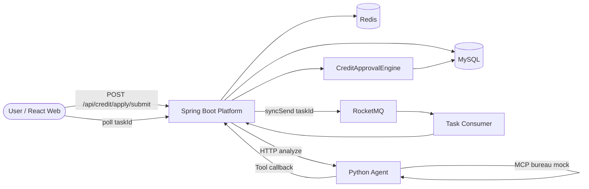

# AI Credit Risk Platform

面向消费信贷审批场景的智能风控系统。Java 平台负责申请受理、异步调度、规则终审与数据持久化；Python Agent 负责 Multi-Agent 风险分析。Agent 只输出 `SUGGEST_*` 建议，最终 `APPROVED` / `REJECTED` / `MANUAL_REVIEW` 由 Java `CreditApprovalEngine` 决定。

> 适用场景：消费信贷申请 → 异步风控分析 → 规则引擎终审 → 人工复核兜底

---

## Features

- **RocketMQ 异步审批** — 申请提交与 Agent 执行解耦，`syncSend` 确认投递，失败标记 `MQ_SEND_FAILED` 并支持管理端补偿
- **Workflow + Checkpoint** — 10 节点顺序执行，MySQL 持久化节点状态，进程重启后从最后成功节点续跑
- **Multi-Agent + Java 规则终审** — 文档审核 / 征信评估 / 反欺诈三 Agent 加权共识，额度与利率由规则引擎计算
- **三层幂等** — HTTP `Idempotency-Key`、Workflow 状态缓存、Redis 分布式锁 + DB CAS
- **DLQ + 人工补偿** — Consumer 最多 16 次重试，超限进死信队列并转 `MANUAL_REVIEW`
- **全链路追踪** — `traceId` / `workflowId` 贯穿 HTTP、MQ、Agent 节点与审计日志
- **结构化 LLM 输出** — Pydantic Schema 校验 + JSON Repair，失败触发节点重试
- **Agent 熔断降级** — 超时 / 熔断 / 不可用时不硬失败，降级为人工复核

---

## Architecture



**调用概要**

```
Submit → 创建 AsyncTask + Workflow(INIT) → RocketMQ
       → Consumer → Redis Lock + CAS → Python Agent (10 nodes)
       → Java commit → CreditApprovalEngine 终审 → 前端轮询结果
```

详细时序与模块职责见 [docs/architecture.md](docs/architecture.md)。

---

## Tech Stack

| Layer | Technologies |
|-------|--------------|
| **Backend** | Spring Boot 2.3, MyBatis-Plus, MySQL 5.7, Redis 7, RocketMQ 4.9 |
| **AI Agent** | FastAPI, DeepSeek API (OpenAI-compatible), Pydantic, MCP (stdio) |
| **Workflow** | Custom sequential runner (`graph_runner`); LangGraph graph defined for reference |
| **Frontend** | React 18, TypeScript, Vite, Ant Design |
| **DevOps** | Docker Compose, JMeter (`credit-approval-submit-test.jmx`) |

---

## Quick Start

### Option A — Docker Compose (recommended)

```bash
# Set LLM API key first
export OPENAI_API_KEY=your-deepseek-key   # Windows: set OPENAI_API_KEY=...

docker compose up --build
```

| Service | Port |
|---------|------|
| Web (Nginx) | 80 |
| Spring Boot | 8082 |
| Python Agent | 8090 |
| MySQL | 3307 |
| Redis | 6379 |
| RocketMQ NameServer | 9876 |

**First run:** import SQL into MySQL container:

```bash
docker exec -i credit-mysql mysql -uroot credit < credit-risk-platform/src/main/resources/db/credit_schema.sql
docker exec -i credit-mysql mysql -uroot credit < credit-risk-platform/src/main/resources/db/credit_seed.sql
# Run V001–V006 migrations under db/migration/
```

### Option B — Local development

**Prerequisites:** JDK 8+, Maven 3.6+, Python 3.10+, Node.js 18+, MySQL, Redis, RocketMQ, DeepSeek API Key

```bash
# 1. Database (schema + seed + migrations V001–V006)
mysql -u root -p < credit-risk-platform/src/main/resources/db/credit_schema.sql
mysql -u root -p credit < credit-risk-platform/src/main/resources/db/credit_seed.sql

# 2. Backend
cd credit-risk-platform && mvn spring-boot:run

# 3. Agent
cd credit-agent && pip install -r requirements.txt
cp .env.example .env   # fill OPENAI_API_KEY
uvicorn app.main:app --host 0.0.0.0 --port 8090

# 4. Frontend
cd credit-risk-web && npm install && npm run dev
```

Open `http://localhost:5173` (dev proxy `/api` → `8082`).

### Demo flow

1. `/login` — seed phone `13800000001`; dev mode returns SMS code in response
2. `/apply` — submit application, get `taskId`
3. `/tasks/:taskId` — poll until `SUCCESS` or `MANUAL_REVIEW`
4. `/applications` — view final decision and risk score
5. `/admin/reviews` — admin approve/reject manual review tickets

More setup details: [docs/deployment.md](docs/deployment.md)

---

## Project Structure

```
.
├── credit-risk-platform/   # Spring Boot — API, MQ, rules, workflow, tools
├── credit-agent/           # FastAPI — Multi-Agent workflow, MCP, resilience
├── credit-risk-web/        # React — apply, poll, admin review
├── docker/                 # RocketMQ broker config
├── docs/                   # Detailed design docs
├── docker-compose.yml
└── credit-approval-submit-test.jmx
```

---

## Core Design

| Topic | Summary | Details |
|-------|---------|---------|
| **Reliable MQ Workflow** | `syncSend` + task status machine + DLQ → manual review; admin redelivery API | [docs/rocketmq.md](docs/rocketmq.md) |
| **Workflow Persistence** | `tb_workflow` / `_node` / `_checkpoint`; 3 retries with 2/4/8s backoff | [docs/workflow.md](docs/workflow.md) |
| **Agent Decision Flow** | 3 LLM agents + weighted consensus; Java owns final approval | [docs/agent.md](docs/agent.md) |
| **Idempotency** | Submit key → Workflow result cache → Redis lock + CAS | [docs/idempotency.md](docs/idempotency.md) |
| **Observability** | `tb_audit_log`, Micrometer metrics, workflow trace APIs | [docs/observability.md](docs/observability.md) |
| **Resilience** | Circuit breaker, LLM rate limit, MCP timeout → manual review | [docs/agent.md#resilience](docs/agent.md#resilience) |

Architecture rationale (Java/Python split, OCR, cache strategy): [docs/architecture.md](docs/architecture.md)

---

## Performance Test

JMeter script: `credit-approval-submit-test.jmx` — 1000 concurrent submit requests, 0% HTTP errors.

| Mode | Avg | P95 | Throughput | Task status |
|------|-----|-----|------------|-------------|
| **MQ** (`credit.mq.enabled=true`) | 2543 ms | 6670 ms | 18.10 req/s | `MQ_SENT` |
| **Direct** (local thread pool fallback) | 290 ms | 481 ms | 96.99 req/s | `PENDING` |

**Interpretation:** Direct mode uses in-process `ThreadPoolTaskExecutor` — faster submit response, no broker overhead. MQ mode adds durable delivery, consumer retry, DLQ, and audit trail — suitable for reliable async task dispatch at the cost of higher submit latency (includes `syncSend` confirmation).

Raw reports: `jmeter-results/`, `jmeter-results-direct/`. Full analysis: [docs/performance.md](docs/performance.md)

---

## Documentation

| Doc | Contents |
|-----|----------|
| [docs/architecture.md](docs/architecture.md) | System design, module roles, design decisions |
| [docs/workflow.md](docs/workflow.md) | Node pipeline, checkpoint, retry, APIs |
| [docs/rocketmq.md](docs/rocketmq.md) | Producer/consumer, DLQ, redelivery, vs Direct mode |
| [docs/agent.md](docs/agent.md) | Multi-Agent flow, tools, MCP, resilience |
| [docs/idempotency.md](docs/idempotency.md) | Three-layer idempotency, duplicate consumption |
| [docs/observability.md](docs/observability.md) | Audit log, metrics, admin APIs |
| [docs/performance.md](docs/performance.md) | JMeter setup and benchmark results |
| [docs/deployment.md](docs/deployment.md) | Local/Docker setup, config, security notes |

---

## Testing

```bash
# Java
cd credit-risk-platform && mvn test

# Python
cd credit-agent && pytest -q

# E2E / stability subset
cd credit-risk-platform && mvn test -Dtest="*E2ETest,*GrayTest,*StabilityTest"
```

---

## Roadmap

- [ ] `asyncSend` + callback to reduce submit RT while keeping delivery guarantee
- [ ] Scheduled scanner for `MQ_SEND_FAILED` auto-redelivery
- [ ] Transactional Outbox for atomic DB insert + MQ send
- [ ] Prometheus / Grafana dashboards on top of Micrometer
- [ ] CI/CD pipeline (GitHub Actions)
- [ ] Distributed LLM rate limiter for multi Agent instances

---

## Security

- Do **not** commit `.env` or real API keys
- Replace default `internal-api-key` and DB credentials in production
- Audit logs may contain sensitive request data — add masking before production use

---

## License

MIT (to be confirmed — no LICENSE file in repo yet)
