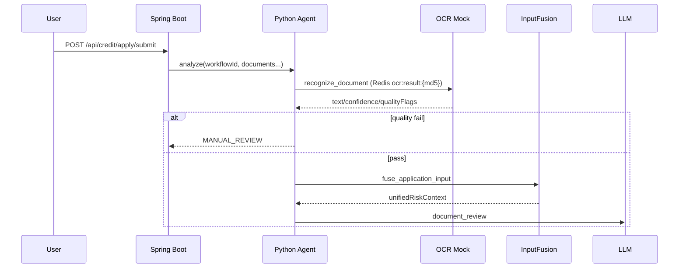
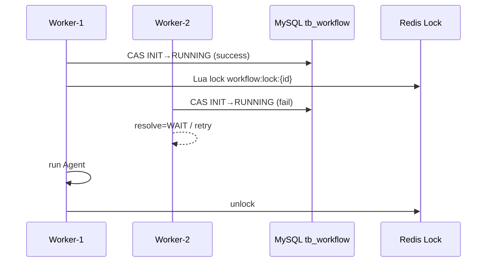
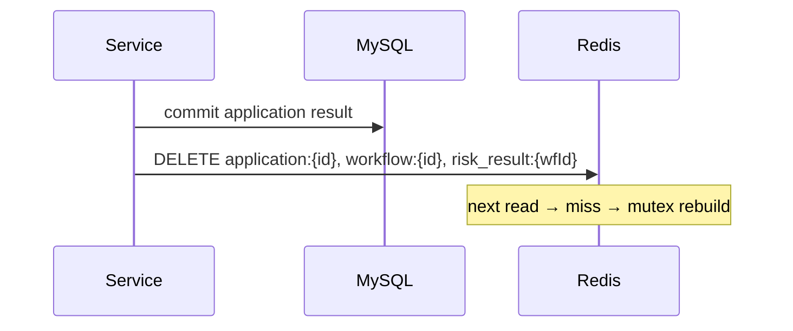

# Architecture

## System Overview

```
credit-risk-web (React, :5173 / Docker :80)
        │  /api
        ▼
credit-risk-platform (Spring Boot, :8082)
        │  RocketMQ / Direct trigger
        │  HTTP POST /v1/agents/credit/analyze
        ▼
credit-agent (FastAPI, :8090)
        │  POST /internal/tools/invoke (47 tools)
        │  MCP stdio (credit bureau — mock in demo)
        └──────────────────────────► Java internal tool gateway
```

| Module | Stack | Responsibility |
|--------|-------|----------------|
| `credit-risk-platform` | Spring Boot 2.3, MyBatis-Plus, MySQL, Redis, RocketMQ | Login, apply API, async tasks, rule engine, manual review, tool gateway |
| `credit-agent` | FastAPI, DeepSeek, Pydantic, MCP | Document review, credit assessment, anti-fraud, consensus (suggestions only) |
| `credit-risk-web` | React 18, TypeScript, Vite, Ant Design | Apply, task polling, admin review UI |

**Decision boundary:** Agent outputs `SUGGEST_*` only. Final `APPROVED` / `REJECTED` / `MANUAL_REVIEW` is decided by `CreditApprovalEngine`.

---

## End-to-End Call Chain

```
User POST /api/credit/apply/submit
  → CreditApplyAsyncService: Idempotency-Key (Redis SETNX + MySQL responseJson)
  → CreditApplySubmissionTxService @Transactional:
       insert CreditAsyncTask (PENDING)
       initWorkflowIfAbsent → tb_workflow (INIT)
       insert tb_mq_outbox_event (NEW)
  → HTTP 返回 taskId
  → MqOutboxPublisher (polling) → CreditApprovalTaskProducer.syncSend → task MQ_SENT
  → CreditApprovalTaskConsumer.onMessage
  → CreditApplyAsyncProcessor: RUNNING, draft application, acquire lock
  → AgentRemoteClient → Python /v1/agents/credit/analyze
  → Python graph_runner: 10 nodes, tool callbacks to Java
  → CreditApplyWorkflowService.commit → CreditApprovalEngine.decide()
  → task SUCCESS / MANUAL_REVIEW, cache evict
  → Frontend polls GET /api/credit/apply/task/{taskId}
```

> Polling Outbox 是当前实现，后续可替换为 binlog/CDC 或 RocketMQ 事务消息。

---

## Module Responsibilities (Java)

| Package / Component | Role |
|---------------------|------|
| `CreditApplyController` | HTTP submit, task poll, application detail |
| `CreditApplyAsyncService` | Task creation, idempotency, submission orchestration |
| `CreditApplySubmissionTxService` | Transactional task + workflow + outbox |
| `MqOutboxPublisher` | Polling outbox → RocketMQ send |
| `CreditApplyAsyncProcessor` | Consumer worker: Agent call + commit |
| `CreditApprovalEngine` | Sole final approval authority |
| `ToolInvokeService` + `ToolRegistry` | Internal tool gateway for Python |
| `WorkflowExecutionService` | Lock + idempotency + CAS acquire |
| `CreditApprovalTaskProducer/Consumer` | RocketMQ dispatch |
| `AgentRemoteClient` | HTTP to Python Agent |

---

## Agent Workflow (10 nodes)

```
load_memory → ocr_preprocess → input_fusion → document_review → document_verify
→ credit_assessment → anti_fraud → consensus → suggestion_routing → final
→ Java CreditApprovalEngine
```

- **OCR:** materials converted to text via `MockOcrService` (Tencent/Aliyun interfaces reserved); LLM does not read raw images
- **Input Fusion:** structured fields + user narrative + OCR text → `unifiedRiskContext`
- **Spring Tools:** memory, product, document verify, fraud signals, persistence, cache
- **MCP Tools:** credit bureau, court enforcement, income stability (mock in demo)

> **Note:** `credit_risk_ops_graph.py` defines a LangGraph `StateGraph`, but production runtime uses `graph_runner.py` sequential loop — not `graph.invoke()`.

---

## Responsibility Split (Agent vs Rule Engine)

| Layer | Responsibility |
|-------|----------------|
| **Agent** | Material understanding, risk identification, explanation → `SUGGEST_*` |
| **Consensus** | Weighted voting (anti-fraud 45%, credit 35%, doc 20%); conflict → manual |
| **Java Rule Engine** | Dynamic product rules + risk scores → final decision, amount, rate, term |

`credit_advisory` agent was removed — LLM must not decide credit terms; `ProductApprovalCalculator` handles that in Java.

---

## Design Decisions

### Why Java + Python split?

Java excels at transactions, rule engines, MySQL/Redis integration. Python excels at LLM orchestration. HTTP + tool callbacks keep boundaries clear and allow independent scaling.

### Why Java Rule Engine instead of LLM approval?

LLM outputs are non-deterministic. Approval requires explainability, auditability, and reproducibility.

### Why OCR before LLM?

Enterprise risk control works on structured text. OCR is cheaper, confidence is quantifiable, and results are verifiable. LLM resolves contradictions (e.g. declared income vs bank statement).

### Why Workflow state in MySQL?

Persistence, audit, checkpoint resume. Redis is for locks and cache only — MySQL is the source of truth.

### Why Redis Lua lock instead of `synchronized`?

`synchronized` is JVM-local. Multi-instance deployment requires distributed locks.

### Why Cache Aside?

Avoid dual-write inconsistency. Write to MySQL, delete cache on commit, rebuild on next read. Strategies: null cache (2min), TTL jitter (±10%), hot-key mutex rebuild.

### Known gaps

| Gap | Current behavior | Recommended fix |
|-----|------------------|-----------------|
| DB + MQ not atomic | Task may stay `MQ_SEND_FAILED` | Transactional Outbox |
| No auto redelivery job | Admin API manual redelivery | Scheduled compensation task |
| Commit idempotency | Relies on lock + workflow SUCCESS cache | Business-level commit idempotency key |

---

## Sequence Diagrams

### OCR + Input Fusion



### Workflow duplicate consumption guard



### Cache Aside write-through invalidation



---

## Redis Key Reference

| Key | Purpose | TTL |
|-----|---------|-----|
| `workflow:lock:{workflowId}` | Distributed execution lock | 5 min |
| `application:{id}` | Application detail cache | 10 min ±10% |
| `workflow:{id}` | Workflow query cache | on demand |
| `risk_result:{workflowId}` | Risk result cache | on demand |
| `ocr:result:{fileMd5}` | OCR text | 72h |
| `llm:result:{promptVersion}:{inputHash}` | LLM output | 24h |
| `product:{productId}` | Product cache | evict on change |
| `idempotent:{scope}:{key}` | HTTP idempotency | 24h |
| `login:token:{token}` | Session | 30 min |

---

## Product Configuration Tables

| Table | Purpose |
|-------|---------|
| `tb_credit_product` | Product base info (limit range, term, base rate) |
| `tb_product_rule_config` | Product-level rule JSON with versioning |
| `tb_product_material_requirement` | Required/optional materials per product |

Admin rollback APIs:

```http
GET  /api/admin/config/product/{productId}/rules/versions
POST /api/admin/config/product/{productId}/rules/rollback/{version}
```

---

## Exception & Recovery Matrix

| Scenario | Behavior |
|----------|----------|
| OCR low confidence / quality issue | `MANUAL_REVIEW`, skip downstream agents |
| Duplicate workflow submit | `SUCCESS` → cached result; `RUNNING` → 409 / MQ retry |
| Worker crash | Lock expires in 5 min; checkpoint enables resume |
| Agent timeout | Node retry (3×) → `MANUAL_REVIEW` |
| Agent unavailable | Java degrades to manual review, task not hard-failed |
| Cache stampede | Mutex lock, single-thread rebuild |
| MQ max retries exceeded | DLQ → `MANUAL_REVIEW` |
